[](https://classroom.github.com/a/YyUO0xtt)
# COMP2150  - Level Design Document
### Name: Phoebe Johns
### Student number: 47863021
This document discusses and reflects on the design of your platformer level for the Level Design assessment. It should be 1500 words. Make sure you delete this and all other instructional text throughout the document before checking your word count prior to submission. Hint: You can check word count by copying this text into a Word or Google doc.

Your document must include images. To insert an image into your documentation, place it in the "DocImages" folder in this repo, then place the below text where you want the image to appear:

```

```

Example:


## 1. Player Experience

### 1.1. Discovery
| | |
|---|---|
| 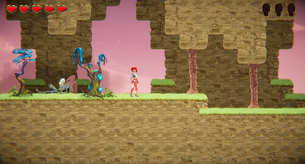 | 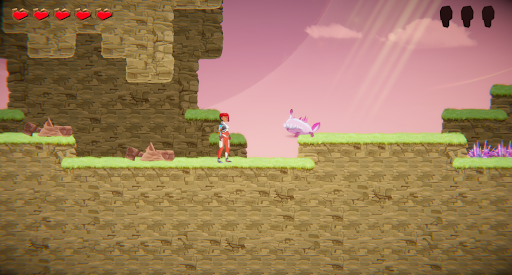 |

The first encounter after picking up the staff involves two breakable columns. It is important to provide the player with a playground to experiment with and understand new mechanics before they are tested on them. This is a philosophy that I tried my best to cling to when designing this level and its sections. The next thing the player will see after breaking the columns is an enemy. This encounter lets the player prove they can handle combat before having to combine it with platforming, more enemies, or other mechanics.

| | |
|---|---|
| 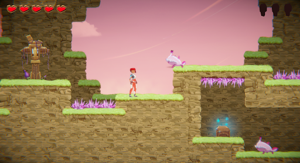 | 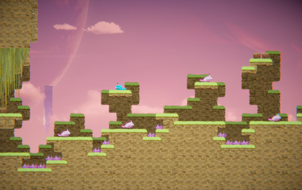 |

Every main section and new mechanic follows a simple design formula. First the player is introduced to the mechanic or mechanics in a safe, experimental environment. After the introductory encounter, a series of developments on those ideas are presented. Each of these encounters present new combinations of established ideas to encourage the player to explore how they can interact with the mechanic. After the player has explored several ideas and approaches regarding a specific mechanic, they reach a ‘final exam’ that tests both their knowledge and execution of the mechanics they have learned. Each of the three main sections crescendo in these final exam encounters, with each section posing a greater challenge than the last.

### 1.2. Drama

What is the intensity curve? How does your design facilitate increasing yet modulating intensity, with moments of tension and relief? 
This process of learning mechanics and building on ideas, as well as the use of the ‘final exam’ design philosophy serves to create a satisfying dramatic arc over the course of the level. In this way, each section serves as a complete dramatic arc of its own with its own peaks and troughs to keep the player in the flow channel as described by Mihaly Csikszentmihalyi. 

| | |
|---|---|
| 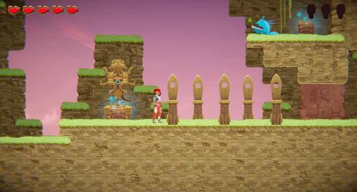 | 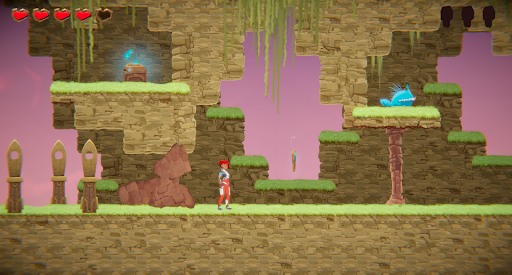 |

Each section concludes with a wind-down in intensity; the player isn’t immediately out of danger after completing the final exam of a section. The danger in these wind-down segments is low, but prevents a jarring drop in the intensity of the level. These sections, always immediately following the final exam, act as one final moment of tension before there can be resolution. They serve the same purpose as the final chord in a piece of music before the resolution, before the cadence is complete. This serves to sweeten and emphasise the relief that the player feels when finally reaching that checkpoint - when finally collecting that key.

### 1.3. Challenge

Players usually have the freedom to choose how they approach an encounter in how they choose to balance their focus between platforming and combat. Some players may choose to defeat every enemy they see as to make platforming easier, while others may put their efforts into evading and manoeuvring around enemies and projectiles. To encourage the player to engage with both systems, certain encounters are staged to heavily favour one approach over another, to give the player practice in all of the game's systems. This also gives them a chance to experiment with different play styles so that by the final exam segments they can have the freedom to express how they wish to play.

There are two main types of challenge in my level: combat and platforming. Both of these types of challenge are taught to the player separately at first and are gradually combined to create interesting encounters. Each encounter serves as development on something that came before. The most challenging encounters in this level are those that combine the mechanics of platforming and combat, requiring the player to balance their priorities and multitask.

### 1.4. Exploration

| | |
|---|---|
| 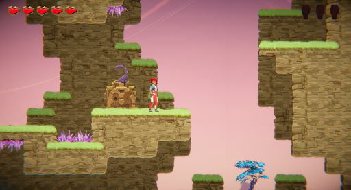 | 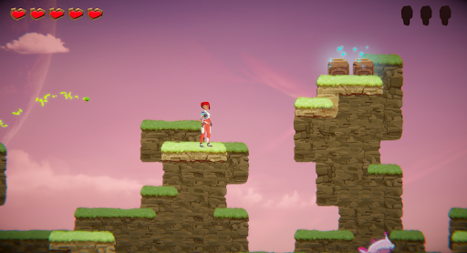 |

My level design makes liberal use of background tiles and surrounding geometry as tools to inform the feeling of each space and encounter. Despite all sections of the level sporting the same tileset and assets, contrasting spaces and feelings can be created through the use of background tiles, ceilings and stalactite formations. Using both positive and negative spaces to convey context and levels of comfort/danger to the player serves to create feelings in players that drive them forward through the level. 

| | |
|---|---|
| 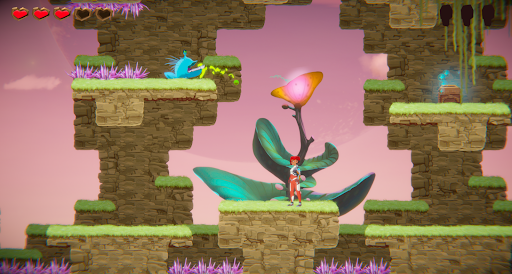 | 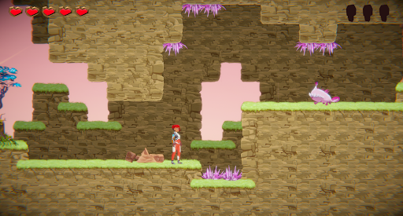 |

Throughout the level there are several little platforms or ledges off the beaten path that the player can choose to investigate. While the topological structure of the level is very linear, small offshoots such as these offer the player a sense of freedom of exploration. The player is usually rewarded for their efforts with one or two heart pickups, which serve as an incentive to explore these offshoots when they see them again. The frequency of these optional heart pickups means that if the player is struggling for health, they can modify their playstyle to focus more on searching and collecting these heart refills.


## 2. Core Gameplay

### 2.1. Checkpoints

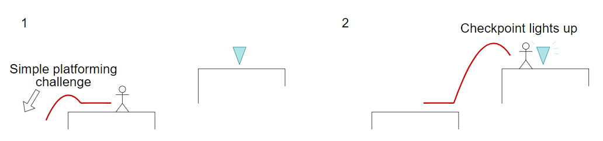

Checkpoints do not become mechanically relevant in the level until the introduction of acid in the second main section. Though, I still have used them to signify to the player when they have overcome an obstacle or to suggest that one may be coming.

### 2.2. Weapon Pickup (Staff)

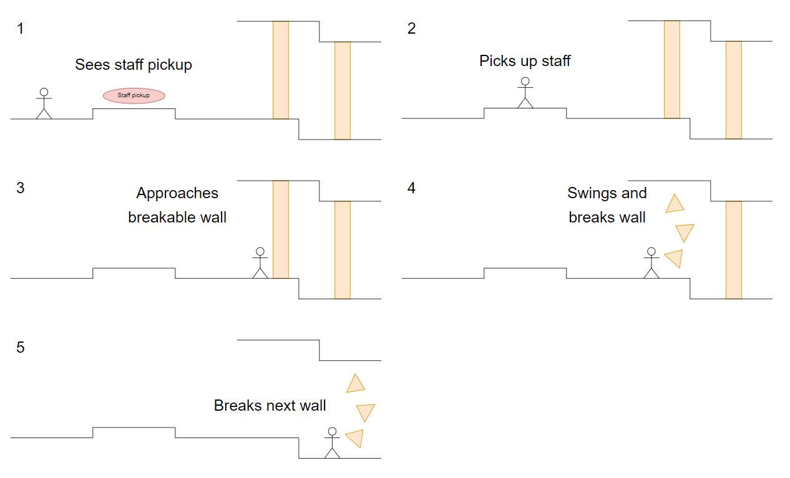

The player is given a safe task to complete with the new mechanic of the staff before they are challenged with an enemy encounter. This ensures that when they do encounter the enemy they already understand swinging the staff.

### 2.3. Spikes

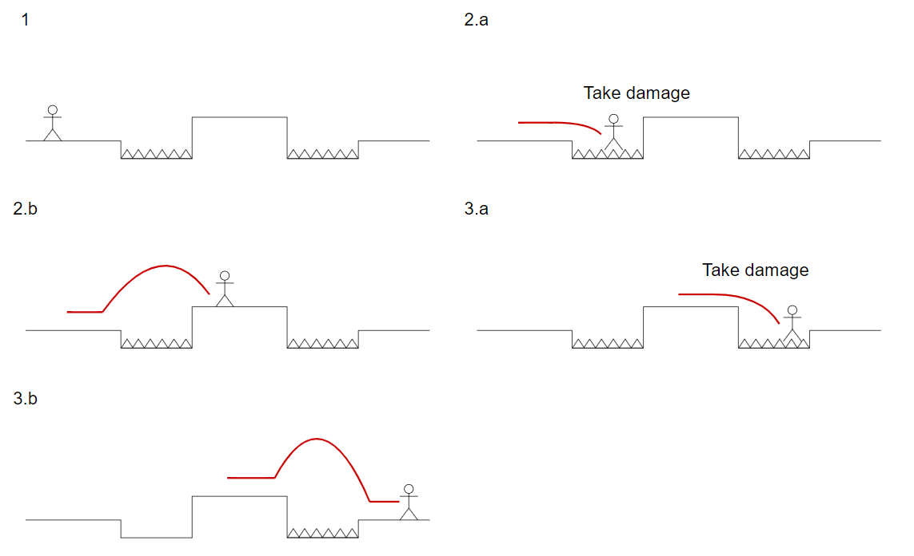

This is the first encounter that involves the player interacting with spikes. Previous appearances of spikes in the level are purely decorative. The very first platforming area at the start of the level has spikes under a floating platform to clarify to the player that tiles cannot be jumped through; this remains true until the explicit introduction of pass-through platforms later on.

### 2.4. Chompers

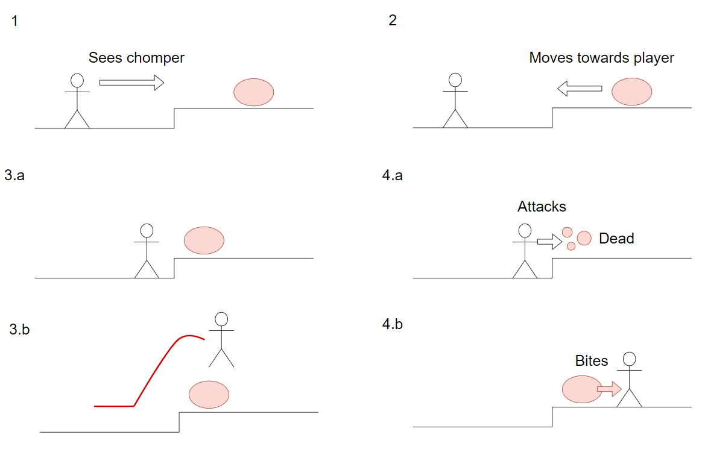

A chomper serves as the first encounter that the player must use the staff. Enemies play a significant role in the level, and so introducing combat very early is important.

### 2.5. Health Pickups

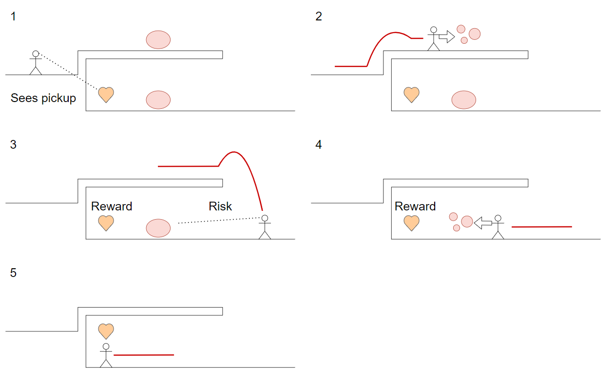

The player sees the heart pickup before they are able to access it, piquing interest in how to acquire it. After they drop they will see the enemy guarding the extra heart and can choose how they wish to engage with the risk/reward of obtaining it.

### 2.6. Spitters

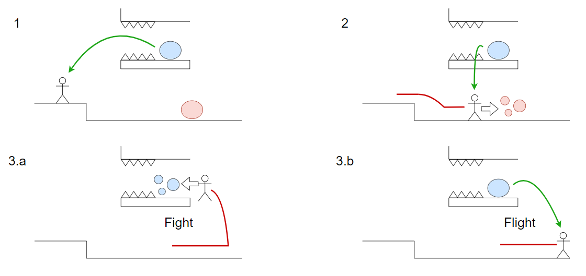

The spitter is introduced on a high perch guarded by spikes. This is to ensure the player doesn’t jump and swing at it straight away like the rest of the enemies and has a chance to observe how it shoots its projectiles.

### 2.7. Keys

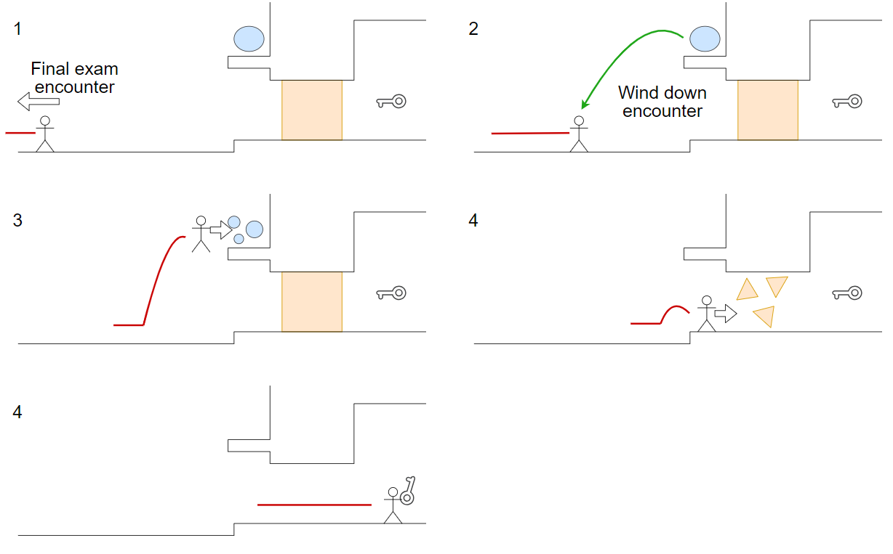

Keys serve as the reward for completing a main section. They are not hidden or optional as they are mandatory to open the exit door. The player can see the key during the wind down section contributing to the tension and relief that it serves.

### 2.8. Moving Platforms

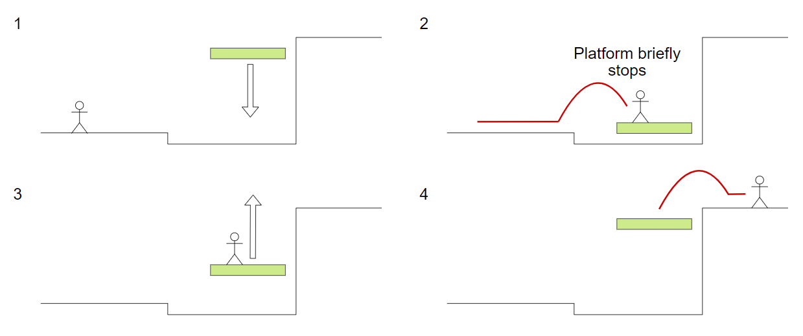

Moving platforms are introduced to the player first in a safe environment. In the final level I added a spitter and heart pickup underneath so the player has something to do in case they miss the platform rising and have to wait.

### 2.9. Acid


Acid serves as an additional layer of depth to the platforming in the level. I introduced it at the start of the section main section to give the player time to acclimate themselves with the controls before introducing punishment for missing a jump.

### 2.10. Passthrough Platforms

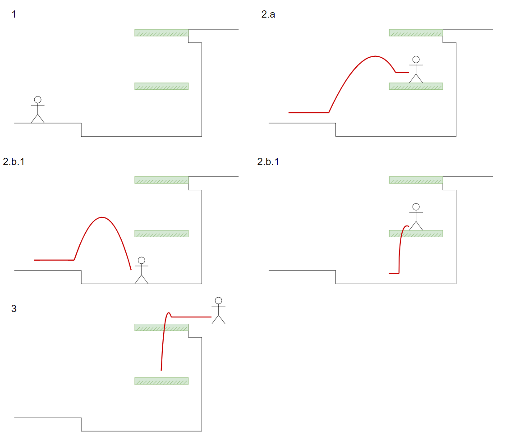

Passthrough platforms are placed in a ladder-like formation to hint to the player that they can be jumped up through directly. This is not geometry they have dealt with with solid tiles yet and so will likely now attempt to jump straight up.

### 2.11. Weapon Pickup (Gun)

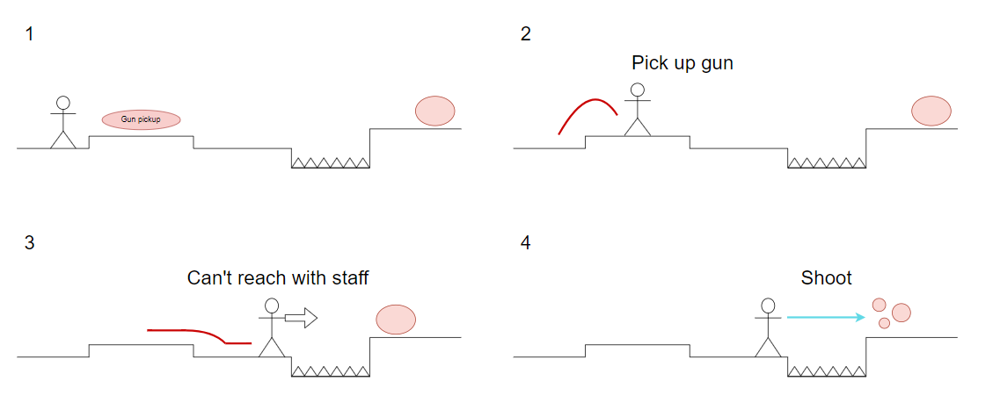

It was important to give the player an immediate reason to use the gun over the staff. By this point they have become comfortable with using the staff to defeat enemies so the task was challenging that comfort.


## 3. Spatiotemporal Design
A section on Spatiotemporal Design, which includes your molecule diagram and annotated level maps (one for each main section of your level). These diagrams may be made digitally or by hand, but must not be created from screenshots of your game. The annotated level maps should show the structure you intend to build, included game elements, and the path the player is expected to take through the level. Examples of these diagrams are included in the level design lectures.

No additional words are necessary for this section (any words should only be within your images/diagrams).
 
### 3.1. Molecule Diagram

### 3.2. Level Map – Section 1

### 3.3. Level Map – Section 2

### 3.4. Level Map – Section 3

## 4. Iterative Design (~400 words)
Reflect on how iterative design helped to improve your level. Additional prototypes and design artefacts should be included to demonstrate that you followed an iterative design process (e.g. pictures of paper prototypes, early grey-boxed maps, additional storyboards of later gameplay sequences, etc.). You can also use this section to justify design changes made in Unity after you drew your level design maps shown in section 3. 

You should conclude by highlighting a specific example of an encounter, or another aspect of your level design, that could be improved through further iterative design.

## Generative AI Use Acknowledgement

Use the below table to indicate any Generative AI or writing assistance tools used in creating your document. Please be honest and thorough in your reporting, as this will allow us to give you the marks you have earnt. Place any drafts or other evidence inside this repository. This form and related evidence do not count to your word count.
An example has been included. Please replace this with any actual tools, and add more as necessary.


### Tool Used: ChatGPT
**Nature of Use** Finding relevant design theory.

**Evidence Attached?** Screenshot of ChatGPT conversation included in the folder "GenAI" in this repo.

**Additional Notes:** I used ChatGPT to try and find some more relevant design theory that I could apply to my game. After googling them, however, I found most of them were inaccurate, and some didn't exist. One theory mentioned, however, was useful, and I've incorporated it into my work.

### Tool Used: Example
**Nature of Use** Example Text

**Evidence Attached?** Example Text

**Additional Notes:** Example Text


